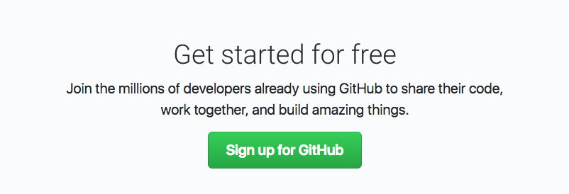
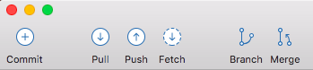
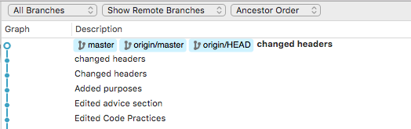
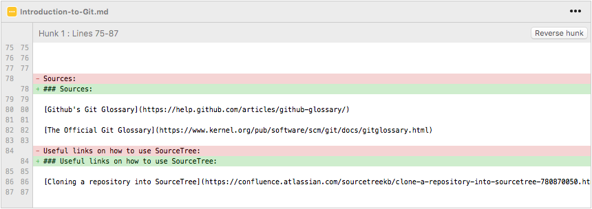
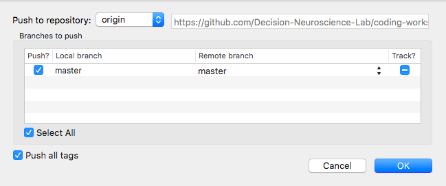
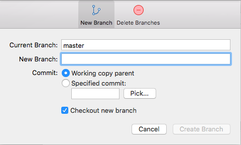

# 2. Introduction to Git
This section of the workshop provides a quick tutorial to Git, open source collaboration and version control.

 

## Introduction to Git

### What is Git?
Founded in 2005 by Linus Torvalds, Git is currently the most widely used version control system. Many organisations and official projects use Git as a system for collaboration and version control. Git also allows for people to work on casual open source projects, where anyone on the internet can contribute to a person's existing code, or duplicate a copy to play around on their own. 

Git works using repositories, which are like archives or folders for your code. Each repository contains code files (such as MATLAB, R, C or python scripts) but also keeps track of all changes that people have made to the code over time. As a collaborative tool, Git allows each developer or collaborator to have a working copy of a repository, from which they can pull (download) or push (upload) new changes to the master copy.

### Some resources:

[Getting started/hello world activity](https://guides.github.com/activities/hello-world/)

[Github guides and tutorials](https://guides.github.com/)

[Video on using Git commands](https://www.youtube.com/watch?v=0fKg7e37bQE)

Here are some guides that show how using Git can be a powerful way to collaboratively develop code:

[Github introduction to flow](https://guides.github.com/introduction/flow/)

[Github comparing workflows](https://www.atlassian.com/git/tutorials/comparing-workflows)

Here is a [tutorial](https://guides.github.com/activities/forking/) showing how you can also copy entire repositories to your own account, for when you want to make your own versions of experiments or analysis code.

When first using Git I would recommend making some test repositories (see the ‘hello world’ tutorial above) and playing around with different commands to see what they do. This might be easier once you install a Git program on your computer (see step 4).

Also, Github offers [free private repositories](https://education.github.com/pack) for all students, so that you can upload your own code and protect it from prying eyes.

## Setting up a Git account

### Github

Github is the most popular website for storing Git repositories, and is used by many researchers. You can sign up for Github at [github.com](https://github.com). Academic accounts get up to 5 free private repositories, which are useful to hide your work from others.

Github only offers up to 20 private repositories for larger groups/organisations such as our lab, so instead we will use Bitbucket to host our files.

### BitBucket

The lab will be hosting projects on BitBucket in the future. When you create a BitBucket account, use a **.edu** email to get unlimited private repositories. You can do this at [bitbucket.org](https://bitbucket.org). Bitbucket offers unlimited private repositories to anyone with a .edu email address.

## Joining the Decision Neuroscience Lab organisation

Get added to the Lab Members team in the [Decision Neuroscience Lab organisation](https://bitbucket.org/Decision-Neuroscience-Lab/). This is the lab account which hosts code for completed and in-progress projects. After you have signed up to Bitbucket please email Daniel F (or another admin that you know of) with your username and they will add you to the team. 

The organisation Github page can be found [here](https://github.com/Decision-Neuroscience-Lab).

The organisation Bitbucket page can be found [here](https://bitbucket.org/Decision-Neuroscience-Lab/)

## Download and install an application that interfaces with Git

Download and install an application that interfaces with Git. Which program you use depends on your personal preferences. Some popular programs are [SourceTree](www.sourcetreeapp.com/), [Github Desktop](https://desktop.github.com/) and [TortoiseGit](https://tortoisegit.org/) (but please add recommendations of other good alternatives). Sourcetree is a great application for beginners as it uses a GUI and has nice graphical displays of the history of code modifications in a project.

A tutorial for SourceTree can be found [here](https://github.com/GSoft-SharePoint/Dynamite/wiki/Getting-started-with-SourceTree,-Git-and-git-flow).

Video tutorials for these softwares:
[Getting started with Git on Sourcetree](https://www.youtube.com/watch?v=UD7PV8auGLg)
[Git for Bitbucket and Sourcetree](https://www.youtube.com/watch?v=R3iU_CKGKUo)
[Github Desktop tutorial](https://www.youtube.com/watch?v=BKr8lbx3uFY)

## Useful features of Git (e.g. push, pull, branch) demonstrated in Sourcetree

Most of SourceTree's main working functions can be found in the toolbar, at the top of the interface.

### Important Git features:

**Clone:** A clone is a copy of the repository that exists on your computer, instead of on a web server. It also refers to the act of duplicating the copy. After cloning, you can edit the files on your computer even when offline, and sync them when you are back online.

**Commit:** A commit is an individual change to a file or repository. It allows you to keep a record of what changes were made, and by who. A commit usually comes with a short message, where you can type a mini description about what you changed.

(Examples of commits and changes you can view on the SourceTree app)

**Pull:** Pull refers to when you are bringing in previous changes, and merging them to your copy. For example, after someone edits a file from the last time you've seen the repository, you can integrate or 'pull' their changes into your copy.

**Push:** Pushing refers to uploading your committed changes onto your repository, on a server such as Github or Bit Bucket. Once you push the changes you make, others can see them.

**Pull request:** Pull requests are proposed changes, or change requests, that can be either accepted or rejected by collaborators working on repository. For example, someone might add a new feature and submit a pull request, prompting others to discuss and review these changes before merging them into the main code.

[About Pull Requests (Github)](https://help.github.com/articles/about-pull-requests/)

[Making pull requests on BitBucket](https://www.atlassian.com/git/tutorials/making-a-pull-request)

**Branch:** A branch is a parallel version of a repository. It exists within the repository, but editing it does not change the master, or primary branch. A separate branch allows you to work on the project without affecting the "master" version. When you are happy with your changes, you can **merge** your branch with the master branch to publish the changes.

### Sources:

[Github's Git Glossary](https://help.github.com/articles/github-glossary/)

[The Official Git Glossary](https://www.kernel.org/pub/software/scm/git/docs/gitglossary.html)

### Useful links on how to use SourceTree:

[Cloning a repository into SourceTree](https://confluence.atlassian.com/sourcetreekb/clone-a-repository-into-sourcetree-780870050.html)

[Commit, push and pull a repository in SourceTree](https://confluence.atlassian.com/sourcetreekb/commit-push-and-pull-a-repository-on-sourcetree-785616067.html)

[Branch Management](https://confluence.atlassian.com/sourcetreekb/branch-management-785325799.html)

These are based on older versions of SourceTree, but the functions should still work the same way

## Navigation

<<< [Writing Clear Code](https://github.com/Decision-Neuroscience-Lab/coding-workshop-material/blob/master/Writing-Clear-Code.md)

[Code Peer-Review](https://github.com/Decision-Neuroscience-Lab/coding-workshop-material/blob/master/Code-Peer-Review.md) >>>

[Back to workshop overview](https://github.com/Decision-Neuroscience-Lab/coding-workshop-material/blob/master/Coding%20Workshop%20DNLab.md)
