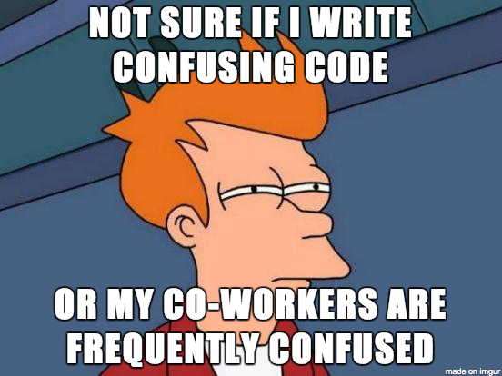

# Writing Clear Code

Some links to start out:

[MIT - Good MATLAB Programming Practices](http://www.mit.edu/~pwb/cssm/GMPP.pdf)

[Minimizing bugs in Cognitive Neuroscience programming](http://journal.frontiersin.org/article/10.3389/fpsyg.2014.01435/full)

[Writing Clear Code - Princeton University](http://introcs.cs.princeton.edu/java/11style/)

[Top MATLAB 10 Practices that make me cry](https://blogs.mathworks.com/videos/2010/03/08/top-10-matlab-code-practices-that-make-me-cry/)

[IBM - Six Ways to Write more Comprehensible Code](https://www.ibm.com/developerworks/library/l-clear-code/)

[Top 15+ Best Practices for Writing Super Readable Code](https://code.tutsplus.com/tutorials/top-15-best-practices-for-writing-super-readable-code--net-8118)

## Purpose and examples of clear/unclear code 

### Purposes:

- Clean code is easy to read

- Makes it easier to pass your project on to the next person

- Easier for yourself/others to spot an error, and debug it early.

- Allows for easier collaboration, less confusion among teammates.

### Example of unclear code:

### Example of clear code:

## Advice on writing and formatting MATLAB code

- Use long variable names with underscores (HELLO_DECISION_NEUROSCIENCE_LAB) to avoid lengthy documentation.
It is also easier for others to understand your variables and functions.

- Make good use of comments, but avoid super-obvious ones.

- Adopt a guideline for variable usage and commenting style.

- It's nice to line up equal signs, spaces, and commas; this helps a lot with spotting errors.

- Have consistent indentation and styling. Styling is a personal preference, but keeping the styling consistent
makes it easier to read.

- Keep functions small! They can be reused for other functions. It also helps make it easier to read.

- If possible, try to keep lines short by using ellipsis (...)

- Large indents can help late at night when those 2-space indents are hard to see.

Source: [MIT - Good MATLAB Programming Practices](http://www.mit.edu/~pwb/cssm/GMPP.pdf)

If you feel particularly passionate about code formatting then you might want to read [The Elements of Matlab Style](https://www.bookdepository.com/The-Elements-of-MATLAB-Style-Richard-K-Johnson/9780521732581?ref=grid-view). This book contains a hundreds of tips for writing clearer MATLAB code. Some example tips are listed [here](http://blogs.mathworks.com/loren/2011/02/10/book-review-the-elements-of-matlab-style/).

## Lab coding standards and practices


**Variable naming**

Different projects use different naming conventions for variables, structures and functions in MATLAB. For example:

`VariableName`

`variableName`

`variable_name`

`Variable_Name`

`Structure.VariableName`

`structure.variable_name`

`VARIABLENAME`

`VARIABLE_NAME`

For large projects teams usually agree on variable naming conventions to be used throughout the project. This makes the code a lot clearer and variables become easy to identify. It also means that you don’t need to check how a variable was formatted each time you use it. 

Each person has their preferred variable naming style (and might use different styles in separate projects). However setting a 'lab standard' variable naming style is useful to help us to easily read other lab members' code. This would be especially useful in code reviews (so that others don't need to adjust to a new style).

The convention we will use for variables is called **lower camel**. This style uses a lower case letter to begin the first word of a variable name. Subsequent words begin with a capital letter, which looks like humps on a camel’s back. Further information can be found [here](https://en.wikipedia.org/wiki/Camel_case).

For example: 

`lowerCamelCase`

`exampleVariableName`

`reactionTime`

In MATLAB we will use a different naming convention for structures. The first letter of each word will be capitalised (known as **upper camel**). By doing this we can easily identify structures and variables based on how they are named. 

For Example:

`Structure.lowerCamel`

`StoredData.reactionTimes`

To differentiate variables and structures from function names we will use **lowercase letters and underscores** for function names.

For example:

`display_stimulus(inputArg1, inputArg2)`

`record_reaction_time(trial, reactionTimeThisTrial)`

Functions from toolboxes or other projects (e.g. PsychToolbox) will have different conventions for function names (PsychToolbox uses upper camel, EEGlab and DDTBOX uses lower case with underscores). This mixture of function naming conventions is unavoidable, however it is usually easy to distinguish a function from a variable after some experience with MATLAB code and the toolboxes that you commonly use.

  

[Introduction to Git](https://github.com/Decision-Neuroscience-Lab/coding-workshop-material/blob/master/Introduction-to-Git.md) >>>

[Back to workshop overview](https://github.com/Decision-Neuroscience-Lab/coding-workshop-material/blob/master/Coding%20Workshop%20DNLab.md)
